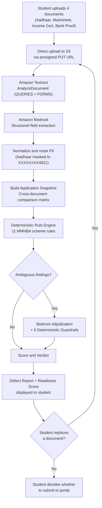

# Defect Guard

A Pre-submission document checker for Indian government scholarship applications, featuring an institutional editorial verification studio, a fully functional offline deterministic evaluation engine, and an architected, code-complete AWS serverless + Amazon Bedrock backend blueprint.

Built with ❤️ for the [First Commit, Bharat Builds Tour](https://wemakedevs.org) (WeMakeDevs x AWS) hackathon, September 17-20, 2026.

---

> [!IMPORTANT]
> ### Evaluation Notice: AWS Cloud Integration Status
> **To all hackathon judges, evaluators, and visitors:**
>
> All backend source code for our AWS serverless pipeline—including AWS SAM infrastructure templates (`infra/template.yaml`), 7 Lambda function handlers (`backend/src/handlers/`), Amazon Textract query schemas, Amazon Bedrock structured prompt assemblies with deterministic guardrails, and DynamoDB single-table adapters—is **fully written, unit-tested (101+ pytest unit tests), and present in this repository**.
>
> However, **the live AWS cloud console deployment and active account-level cloud integration was NOT completed during the hackathon**. Our team had limited prior practical background with production AWS cloud service administration and ran into substantial technicalities—namely AWS account console setup, IAM role trust policies, cross-region Bedrock model access approvals, and network/service connectivity hurdles under strict hackathon deadlines.
>
> **We do not want to mislead anyone into believing live AWS services are currently running in the cloud for this submission.** The actual deployed cloud console integration was left to be continued.
>
> Instead, to ensure an evaluation experience that is 100% stable, deterministic, and instant with zero dependency on unfinished cloud wiring, we built **Demo Mock Mode**. It runs completely offline using Pydantic-validated fixtures, an in-browser state machine, and verified deterministic logic. **Please evaluate Defect Guard using Demo Mock Mode.**

---

## The problem

Government scholarship applications in India have this one annoying problem of getting rejected for clerical reasons more often than for eligibility issues. The verification process is a document-versus-form matching exercise, and students have no way to catch mistakes before they submit.

For Example, A student applying for the [Mukhya Mantrir Nijut Babu Aasoni (MMNBA 2026)](https://highereducation.assam.gov.in) scheme in Assam must upload an Aadhaar card, income certificate, marksheet, and bank proof. If the student's name is spelled `ANTARJIT DAS` on the Aadhaar but `ANTARJEET DASS` on the marksheet, or if the income certificate shows Rs 4,50,000 against the Rs 4,00,000 ceiling, the application comes back weeks later, rejected, with no specific guidance on what to fix.

Nobody owns the cross-document view. The portal checks file format, not truth. Nothing compares documents against each other before submission.

---

## What we built

Defect Guard checks a student's scholarship documents before final portal submission. Designed to the visual and rigor standards of an institutional statutory registry, the student uploads four mandatory documents, and within seconds the system:

1. Extracts identity, economic, academic, and bank fields from each document independently using Amazon Textract and Amazon Bedrock
2. Builds an Application Snapshot, a unified comparison matrix showing what each document actually says, side by side
3. Evaluates 11 deterministic MMNBA scheme rules (name mismatches, income ceiling breaches, missing documents, file quality issues)
4. Uses Bedrock to adjudicate ambiguity, for example whether `ANTARJIT DAS` vs `ANTARJEET DASS` is a real mismatch or a harmless transliteration variant
5. Produces a Defect Report with a ranked list of findings (RED / AMBER / VERIFY), each naming the rule, the conflicting documents, and concrete instructions on what to fix
6. Calculates an Application Document Readiness Score: `100 - 25 x REDs - 10 x AMBERs`, mathematically transparent and fully traceable

The student can then replace a defective document and re-check instantly, watching findings clear and the readiness score dynamically improve in real time.

So far, we have a working mock demo for 1 scheme (the Mukhya Mantrir Nijut Babu Aasoni - MMNBA 2026) supported under our proposition, which is a premier student scholarship scheme by the Government of Assam, India, to support male students under statutory income and educational eligibilities.

### Two operating modes

| Mode | Purpose | AWS required? | Status | Interface |
|------|---------|---------------|--------|-----------|
| **Demo Mock Mode** (default) | 100% offline, deterministic, instant. Designed for hackathon evaluation and zero-latency local testing. | No | **Active & Evaluated** | Studio Workspace + Mock Engine |
| **Live AWS Cloud Mode** | Target serverless pipeline with real Textract OCR, Bedrock reasoning, S3, and DynamoDB. | Yes | **Code-Complete / Live Deployment Pending** | Studio Workspace + AWS API Gateway |

Users can select their desired mode via the dedicated **Mode Chooser screen** (`index.html?select=1`), or explore scheme guidelines on the **Institutional Landing Page** (`landing.html`).

---

## How it works



The core loop: Upload, Extract, Snapshot, Check, Fix, Re-check, Ready.

In Demo Mock Mode, the entire flow runs offline using Pydantic-validated fixtures and a deterministic state machine backed by `sessionStorage`. Live AWS Mode is designed to route each step through real AWS services via API Gateway once console deployment is complete.

---

## Proposed AWS architecture (Code-Complete Blueprint)

Defect Guard's target production proposition is serverless, architected for deployment in ap-south-1 (Mumbai) using AWS SAM. 

> [!NOTE]
> All Lambda handlers, SAM CloudFormation templates, Textract query structures, Bedrock prompt assemblies, and DynamoDB schemas detailed below are **fully written in the codebase** (`backend/src/handlers/`, `infra/template.yaml`). However, as noted in our evaluation notice, the active AWS console setup, IAM permission wiring, and live cloud deployment were not completed during the hackathon. It represents our architectural blueprint and reference implementation.

| AWS Service | What it does |
|------------|------|
| Amazon API Gateway (HTTP API) | REST endpoints under `/v1` with CORS. The frontend's only backend contact point. |
| AWS Lambda (Python 3.14) | 5 synchronous API handlers + 2 asynchronous worker Lambdas |
| Amazon S3 | Document storage with presigned upload URLs, Block Public Access, AES256 encryption, 1-day auto-expiry lifecycle |
| Amazon DynamoDB | Single-table design (`pk`/`sk`) storing packets, documents, and verdicts. Zero GSIs, zero Scans, PAY_PER_REQUEST. |
| Amazon Textract | Synchronous `AnalyzeDocument` with `QUERIES` + `FORMS` feature types. Role-specific natural language queries per document type. |
| Amazon Bedrock | Claude via Global Cross-Region Inference Profile. Two calls per packet: field extraction and finding adjudication, both using structured JSON output. |
| AWS Amplify | Static frontend hosting connected to the GitHub repo |
| AWS CloudWatch | Structured JSON logging with 7-day retention |

### Why this architecture

Presigned S3 uploads keep document bytes off the Lambda request path, so no file data flows through API Gateway. Async worker Lambdas handle the slow Textract + Bedrock processing (90s/120s timeouts) without blocking the API, which returns `202 Accepted` immediately. Single-table DynamoDB with TTL means automatic cleanup of demo data within 24 hours. Two async Lambda invocations are sufficient for the pipeline; a Step Functions orchestrator would be overkill. The static frontend avoids an entire class of SSR deployment issues.

---

## AI + rule engine

The system separates what AI does from what deterministic logic does, and wraps every AI response in guardrails before it reaches the verdict.

### The rule engine (deterministic)

The rule engine is pure Python with zero boto3 imports, fully testable offline:

- 11 rules sourced from the official MMNBA 2026 executive order, encoded in [`NIJUT_BABU_2026.yaml`](backend/src/core/rules/NIJUT_BABU_2026.yaml)
- Cross-document name matching (R-01, R-02, R-03) using normalized, tokenized comparison
- Income ceiling check (R-07): annual income vs Rs 4,00,000 statutory ceiling, pure arithmetic, no AI involved
- Missing document detection (R-05), gender check (R-06), file quality and format (R-09, R-10, R-11)
- Readiness score computed in Python: `max(0, 100 - 25 x REDs - 10 x AMBERs)`. The LLM never calculates math.

### What AI does

1. Textract extracts raw text, form key-value pairs, and answers to role-specific natural language queries
2. A Bedrock extraction call maps Textract output to typed, schema-validated fields per document
3. A Bedrock adjudication call evaluates only ambiguous findings (flagged `needsAdjudication: true`), for example judging whether `DAS` vs `DASS` is a real conflict or a transliteration variant

### 6 deterministic guardrails

Every Bedrock response passes through these before reaching the verdict:

| # | Guardrail | What it prevents |
|---|-----------|-----------------|
| 1 | Schema validation (Pydantic) | Malformed or missing JSON fields. One retry, then template fallback. |
| 2 | Finding ID lock | The model cannot invent findings. Only IDs produced by the rule engine are accepted. |
| 3 | Evidence grounding | Quoted values in `reason`/`fixInstruction` must exist in the actual extraction data. |
| 4 | Severity lock | AI can only downgrade RED to AMBER for identity rules. It cannot escalate or delete findings. |
| 5 | Confidence cap | Confidence below 0.6 forces AMBER with a cautionary prefix. |
| 6 | Score immunity | Score is computed after guardrails by `core/scoring.py`. AI has no score field in its schema. |

### Template fallback

If Bedrock is offline, throttled, or returns ungrounded output, every finding gets populated with verified text from the YAML ruleset's `defaultReason` and `defaultFix`. The verdict still renders correctly with `aiStatus: FALLBACK_TEMPLATE`.

---

## Tech stack

| Layer | Technology |
|-------|-----------|
| Frontend UI & Design | Vanilla JavaScript (ES6+), HTML5, Tailwind CSS with extended semantic tokens, Google Material Symbols Outlined, Google Fonts (Newsreader display serif, Source Serif Pro). Zero npm dependencies, zero bundler. |
| Backend | Python 3.14, Pydantic v2, PyYAML |
| Infrastructure | AWS SAM, CloudFormation |
| AI / document processing | Amazon Textract (`AnalyzeDocument`), Amazon Bedrock (Claude via Global CRIS) |
| Storage | Amazon S3 (documents), Amazon DynamoDB (single-table) |
| API | Amazon API Gateway (HTTP API) |
| Hosting | AWS Amplify / static web servers (pure client-side delivery) |
| Testing | pytest (backend, 101+ unit tests), Node.js headless verification (frontend mock lifecycle) |
| Compliance | Automated PII sweep script (`scripts/sweep_pii.py`) |

---

## Frontend architecture & editorial design system

The user experience is built around an **institutional editorial design system** inspired by official government gazettes, legal registries, and statutory oversight portals (specified in [`design.md`](design.md)). Rather than adopting generic consumer SaaS patterns, Defect Guard reflects the gravitas, precision, and clarity of state documentation.

### Core design principles

1. **Typographic Authority**:
   - Primary display and headings use classical serif typography (`Newsreader` and `Times New Roman`), evoking administrative authority and statutory credibility.
   - Body copy pairs readable editorial serifs with crisp, monospace and sans-serif fonts for numerical amounts, file names, dates, and rule identifiers (`[R-01]`, `[R-07]`).

2. **Restrained Institutional Palette**:
   - Warm paper background tones (`#FBFBF9`, `#F3F2EE`, `#E8E6E1`) avoid clinical sterile whites.
   - Deep ink-black typography (`#1A1A18`) ensures optimal contrast and readability.
   - Restrained alert colors avoid fluorescent alarms: Burgundy (`#9F2F2F`) for RED blocking defects, Warm Ochre (`#B87A1E`) for AMBER warnings, Forest Green (`#2D7D46`) for verified proofs, and Deep Navy (`#2850ce`) for primary focus.

3. **Zero-Emoji Policy**:
   - The entire application enforces an explicit zero-emoji standard.
   - All status indicators, dropzone badges, and callouts use clean vector iconography via Google Material Symbols Outlined (`error`, `warning`, `check_circle`, `sync`, `verified`) and crisp administrative text.

4. **Forensic Proof Breakdown (3-Column Defect Cards)**:
   Every flagged discrepancy is rendered as a 3-column forensic proof card:
   - **Column 1 — Extraction Evidence**: Quoted values directly cited from the student's submitted documents.
   - **Column 2 — Statutory Implication**: The legal clause, statutory threshold, and scheme consequence.
   - **Column 3 — Actionable Fix**: Exact, step-by-step remediation instructions for the student before portal submission.

5. **Cross-Document Application Snapshot Matrix**:
   - Displays all extracted fields across Aadhaar, Marksheet, Circle Officer Income Certificate, and Bank Proof side-by-side.
   - Identifies conflicting records with highlighted warning rows, complete with cell-level source badges (`[Aadhaar]`, `[Marksheet]`, `[Income Cert]`, `[Bank Proof]`).

6. **Dual-View Operational Architecture**:
   - **Institutional Landing Page (`landing.html`)**: Deep statutory explainer, scheme guidelines for MMNBA 2026, 11-rule verification matrix, privacy architecture, and interactive FAQ accordion.
   - **Mode Chooser Screen (`index.html?select=1`)**: Transparent fork allowing users to enter **Demo Mock Mode** (offline, instant evaluation) or **Live AWS Cloud Mode** (production cloud pipeline).
   - **Studio Workspace (`index.html`)**: Real-time 4-slot dropzone grid with progressive extraction states, dynamic mathematical score calculation (`100 - 25xRED - 10xAMBER`), and one-click compliant document replacement.

---

## Project structure

```
defect-guard/
├── landing.html                # Root entrypoint: Institutional overview & MMNBA 2026 statutory guide
├── design.md                   # Comprehensive editorial design system & typography guidelines
│
├── frontend/
│   ├── index.html              # Dual-view interface: Mode Selector (?select=1) & Studio Workspace
│   ├── landing.html            # Static hosting copy of the institutional overview
│   ├── config.js               # Runtime config (API URL, mock toggle, timing constants)
│   ├── fixtures/               # Pydantic-validated JSON fixtures for mock mode
│   │   ├── packet_checked.json     # Initial verdict: Score 40, 3 planted defects
│   │   ├── packet_rechecked.json   # Post-fix verdict: Score 65, R-07 resolved
│   │   └── packet_extracting.json  # In-progress extraction state
│   └── lib/
│       ├── api.js              # Gateway adapter: routes to MockEngine or AWS API Gateway
│       ├── mock.js             # Offline state machine (sessionStorage-backed, deterministic)
│       ├── mock-data.js        # Synthetic specimen extractions and findings
│       └── types.js            # Frozen domain enums mirroring backend Pydantic models
│
├── backend/
│   ├── requirements.txt        # boto3, pydantic, pyyaml, pytest
│   ├── src/
│   │   ├── core/               # Pure Python, zero boto3 imports, fully testable offline
│   │   │   ├── models.py           # Pydantic v2 data contracts
│   │   │   ├── fields.py           # 21 canonical field keys + Textract queries per role
│   │   │   ├── normalize.py        # Name, date, money, IFSC normalization
│   │   │   ├── validators.py       # Verhoeff checksum, IFSC regex, upload constraints
│   │   │   ├── masking.py          # Aadhaar and bank account PII masking
│   │   │   ├── snapshot.py         # Cross-document comparison matrix builder
│   │   │   ├── scoring.py          # Deterministic readiness score calculator
│   │   │   └── rules/
│   │   │       ├── NIJUT_BABU_2026.yaml  # 11 scheme rules with legal citations
│   │   │       └── engine.py             # Rule evaluation engine
│   │   ├── ai/                 # Bedrock prompt assembly + 6 guardrails
│   │   │   ├── schemas.py          # JSON Schemas for Bedrock structured output
│   │   │   ├── extract.py          # Document extraction prompt builder
│   │   │   ├── adjudicate.py       # Finding adjudication prompt builder
│   │   │   └── validation.py       # 6 deterministic guardrails + template fallback
│   │   ├── aws/                # Thin boto3 wrappers, no business logic
│   │   │   ├── s3_client.py, textract_client.py, bedrock_client.py, ddb.py
│   │   └── handlers/           # Lambda entry points
│   │       ├── create_packet.py, create_upload_url.py, mark_uploaded.py
│   │       ├── run_check_api.py, get_packet.py
│   │       ├── extract_document.py     # Async worker: Textract to Bedrock to normalize
│   │       └── run_check.py            # Async worker: snapshot to rules to adjudicate to score
│   └── tests/                  # 17 test files, 101+ unit tests
│
├── infra/
│   ├── template.yaml           # SAM: 7 Lambdas, HTTP API, DynamoDB, S3, shared IAM role
│   └── samconfig.toml
│
├── samples/
│   └── demo-pack/              # 5 synthetic specimen PDFs + expected.json
│
├── scripts/
│   ├── deploy.ps1              # SAM build + deploy with artifact verification
│   ├── e2e.py                  # Offline end-to-end pipeline simulation
│   ├── verify_mock.js          # Headless Node.js mock verification (8 test steps)
│   └── sweep_pii.py            # Automated PII/Aadhaar masking audit
│
└── docs/
    └── demo-script.md          # 3-minute video recording script
```

---

## Run locally

### Prerequisites

- Node.js v18+ (for mock verification tests only; the frontend itself has zero dependencies)
- Python 3.10+ (for backend tests and the local file server)
- AWS CLI + AWS SAM CLI (only needed for Live AWS Mode deployment)

### Demo Mock Mode (no AWS required)

```bash
# Clone the repository
git clone https://github.com/antarjit-das/defect-guard.git
cd defect-guard

# Start the local server
npm run serve
# or: python -m http.server 3000 --directory frontend
```

Open your browser to:
- **`http://localhost:3000/landing.html`**: Institutional statutory landing page with scheme guidelines and verification criteria.
- **`http://localhost:3000`**: Mode chooser (`?select=1`) and document verification studio workspace.

Click **"Enter Demo Mode"** to launch the interactive workspace with zero configuration.

### Backend tests

```bash
# Install Python dependencies
pip install -r backend/requirements.txt

# Run the full backend test suite (101+ tests)
npm run test:backend
# or: python -m pytest

# Validate frontend fixtures against backend Pydantic models
npm run test:fixtures

# Run mock verification (headless Node.js lifecycle check)
npm test
```

### Environment variables

| Variable | File | Purpose |
|----------|------|---------|
| `window.DEFECT_GUARD_API_URL` | `frontend/config.js` | AWS API Gateway base URL for Live Mode |
| `window.DEFECT_GUARD_MOCK` | `frontend/config.js` | `true` for Demo Mock Mode (default), `false` for Live AWS |
| `DYNAMODB_TABLE` | SAM template | DynamoDB table name |
| `UPLOADS_BUCKET` | SAM template | S3 bucket for document uploads |
| `BEDROCK_MODEL_ID` | SAM template | Bedrock model / inference profile ID |
| `EXTRACT_WORKER_FUNCTION` | SAM template | Extraction worker Lambda name |
| `RUN_CHECK_WORKER_FUNCTION` | SAM template | Check worker Lambda name |

### Live AWS deployment

```bash
# Build the SAM application
sam build --template-file infra/template.yaml

# Deploy to AWS (ap-south-1)
sam deploy --template-file .aws-sam/build/template.yaml --config-file samconfig.toml
```

Or use the deployment script:
```powershell
./scripts/deploy.ps1
```

---

## Demo

A synthetic student named Antarjit Das is applying for the MMNBA 2026 scholarship. Three defects are planted across the demo documents:

| Defect | Rule | Severity | Statutory clause / Details |
|--------|------|----------|----------------------------|
| Name mismatch | R-01 | RED | `ANTARJIT DAS` (Aadhaar) vs `ANTARJEET DASS` (Marksheet) |
| Income ceiling breach | R-07 | RED | Declared ₹4,50,000 exceeds the statutory ceiling of ₹4,00,000 |
| Institution verification | R-04 | AMBER | Cotton University enrollment requires Fee Waiver verification |

### Guided demo flow (3-4 minutes)

1. **Institutional Overview (`landing.html`)**:
   - Review the official MMNBA 2026 scheme briefing, document criteria, 11-rule verification matrix, and privacy architecture.
   - Click **"Start Document Verification"** in the top navigation or hero section.

2. **Mode Selection (`index.html?select=1`)**:
   - The user is presented with the dual operational modes: **Demo Mock Mode** (offline, instant evaluation) vs. **Live AWS Cloud Mode** (production cloud pipeline).
   - Click **"Enter Demo Mode"** to launch the verification workspace.

3. **Document Ingestion**:
   - The Studio interface opens with 4 dedicated proof dropzones: *Aadhaar Identity*, *HS Academic Marksheet*, *Circle Officer Income Certificate*, and *Bank Account Proof*.
   - Click **"Quick-load Demo Pack"** to stage the four specimen PDFs.
   - Observe progressive extraction states transition to verified, with clean Material Symbols vector indicators.

4. **Cross-Document Check**:
   - Click **"2. Check Application"**.
   - **Document Readiness Score**: Displays **40 / 100 [NOT READY]** with explicit mathematical deduction (`100 - 25x2 RED - 10x1 AMBER = 40`).
   - **Application Snapshot Matrix**: Side-by-side comparison table highlights the student name spelling discrepancy in red.
   - **Defect Report**: Three forensic proof cards itemize Extraction Evidence, Statutory Implications, and Actionable Fixes for `[R-01]`, `[R-07]`, and `[R-04]`.

5. **Instant Remediation**:
   - Click **"Replace with Compliant Income Cert (₹2.50L)"** (or drag and drop `Income 250k.pdf` onto the Income Certificate slot).
   - The dropzone turns green and confirms the compliant ₹2,50,000 certificate is staged.

6. **Dynamic Re-check**:
   - The primary action button updates to **"3. Re-check Application (Updated Documents)"**.
   - Click to re-run adjudication: finding `[R-07]` clears immediately.
   - The Readiness Score dynamically recalculates and jumps from **40 → 65 [RISKY]** (+25 points).
   - The student receives transparent guidance to obtain an official name affidavit before submitting to the state portal.

### Sample documents (`samples/demo-pack/`)

All documents are synthetic specimens created for this hackathon. No real PII.

| File | Document role | Data |
|------|--------------|------|
| `Aadhar.pdf` | Aadhaar card | ANTARJIT DAS, Male, DOB 12/03/2004 |
| `HS Marksheet.pdf` | Marksheet | ANTARJEET DASS (planted name variant) |
| `Income 450k.pdf` | Income certificate (defective) | Rs 4,50,000, breaches ceiling |
| `Income 250k.pdf` | Income certificate (compliant) | Rs 2,50,000, within ceiling |
| `Bank Statement.pdf` | Bank proof | ANTARJIT DAS, SBI Dispur |

See [`docs/demo-script.md`](docs/demo-script.md) for the complete video recording script.

---

## Testing and deployment

### Test suite

| Command | What it tests |
|---------|--------------|
| `npm run test:backend` | 101+ pytest unit tests covering the rule engine, scoring, normalizers, validators, snapshot builder, AI guardrails, API handlers, and workers |
| `npm run test:fixtures` | Validates frontend JSON fixtures against backend Pydantic models |
| `npm test` | Headless Node.js verification of the complete mock lifecycle (8 test steps) |
| `npm run build` | Syntax validation (`node -c`) of all frontend JavaScript modules |
| `python scripts/e2e.py` | Offline end-to-end simulation of the full student journey |
| `python scripts/sweep_pii.py` | PII sweep: scans repo for unmasked Aadhaar and account numbers |

### Deployment blueprint (SAM self-hosting)

The repository provides complete SAM infrastructure automation for self-hosting in an AWS account (region `ap-south-1`):

> [!NOTE]
> As highlighted throughout this document, **our team was unable to complete the live AWS console deployment during the hackathon** due to console permissions, IAM policy hurdles, and Bedrock model access approvals. The deployment workflow below represents our code-complete blueprint for anyone deploying this stack into an active AWS account:

- `sam build` compiles the Lambda functions with Python dependencies (including Linux-native Pydantic binaries)
- `sam deploy` creates or updates the CloudFormation stack (`defect-guard`)
- `scripts/deploy.ps1` wraps build + deploy with artifact verification (checks for Pydantic `.so` files)
- The frontend is served as static files via AWS Amplify, S3 website hosting, or any local static web server

---

## Limitations and future work

### Current limitations

- **Live AWS Cloud Mode is code-complete but live cloud deployment is incomplete**:
  While the repository contains complete source code for 7 Lambda handlers, Textract query definitions, Bedrock prompt assemblies with structured JSON schemas, DynamoDB single-table adapters, and a SAM CloudFormation template, **the actual console-level AWS deployment and live cloud infrastructure connection was not completed**. Our team had limited practical experience with production AWS administration and encountered complex technicalities—specifically AWS account console administration, IAM permission policies and cross-service role execution, Bedrock model access approvals, and network connectivity hurdles under hackathon deadlines. We intentionally avoided presenting half-working or unstable live endpoints, choosing instead to focus our submission on a flawless, fully deterministic Demo Mock Mode backed by comprehensive automated test verification.
- **Single scheme only**: Only MMNBA 2026 (Assam) is implemented. The YAML rule system supports multiple schemes, but only one exists today.
- **No user authentication**: Any visitor can create packets and upload documents.
- **Synthetic specimen documents**: All sample documents are synthetic demonstration PDFs created specifically for this hackathon; no actual citizen PII is used.
- **DynamoDB data auto-expiry**: Designed with a 24-hour TTL for demo data cleanup without persistent storage.
- **Aadhaar OCR vs cryptographic validation**: Aadhaar extraction relies on document OCR and Verhoeff check-digit algorithms rather than UIDAI offline XML or QR digital signature verification.
- **Bedrock model enablement prerequisite**: Running the backend live requires manual model enablement for Claude / Amazon Nova in the AWS console. If access is missing, our built-in template fallback engine is engineered to take over.

### Future work

- Multi-scheme support: add YAML rulesets for Nijut Moina, PMS-SC, and other scholarship schemes
- User authentication via Amazon Cognito
- Aadhaar XML digital signature verification for cryptographic identity validation
- Hindi/Assamese language labels on the snapshot and defect report
- Batch processing for institutional use (colleges verifying multiple students)
- Document generator templates so students can preview what a compliant document looks like

---

## What we learned

Bedrock's structured outputs (using `outputConfig.textFormat` with JSON Schemas) solved the biggest integration headache. Instead of parsing free-text LLM responses, the backend receives typed JSON that matches a schema. It can be treated like any other API response.

Separating deterministic rules from AI judgment turned out to matter more than expected. Math (income vs ceiling), presence checks (is the document missing?), and format validation (IFSC regex) do not need an LLM. The model only gets called for genuinely ambiguous problems, like whether `DAS` and `DASS` refer to the same person.

During development, Bedrock occasionally quoted names from its training data instead of from the actual document extraction. The evidence grounding guardrail (checking that quoted values exist in the extraction payload) caught this. Without it, the system would have presented fabricated evidence to students.

Committing Pydantic-validated fixtures and an offline state machine before tackling AWS cloud integration proved to be the single most impactful engineering decision of the project. When AWS console configuration hurdles, IAM intricacies, and Bedrock model access hurdles stalled our live cloud deployment, our team was not left with a broken application. The complete verification workflow, mathematical readiness scoring, and forensic editorial studio were already 100% buildable, testable, and demonstrable offline.

DynamoDB's single-table design works well at this scale. One `Query` call returns the entire packet state (metadata + all documents + latest verdict). No joins, no secondary indexes, no Scan operations. The 24-hour TTL means zero cleanup.

Aadhaar numbers are masked (`XXXXXXXX4821`) at extraction time, before they enter DynamoDB. The unmasked value never gets persisted.

---

## Meet Team Spark

Defect Guard was built by Team Spark from the Department of Computer Science and Technology, Bodoland University, Kokrajhar, Assam.

| Member | Focus | Key contributions |
|--------|-------|-------------------|
| Antarjit Das | Backend Lead and Documentation | Backend architecture, AWS serverless handlers, deterministic rule engine, AWS service integration, and technical documentation. Joint ideation and demo workflow design. |
| Mizingsha Mahilary | Frontend Lead and Project Ideation | Frontend leadership, UI/UX workflow planning, interface structure, and overall project coordination. Joint ideation and demo workflow design. |

### AI coding tools used

As required by hackathon rules, the following AI coding tools supported development:

- Google Antigravity (Gemini): iterative phased development and implementation
- GPT Codex: debugging assistance and verification planning
- ChatGPT: initial problem brainstorming and MVP scoping

---

## License

[MIT](LICENSE), Copyright (c) 2026 antarjit-das
