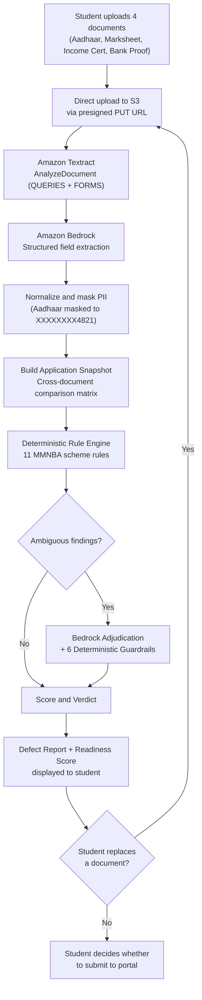

# Defect Guard

A Pre-submission document checker for Indian government scholarship applications, built on AWS serverless + Amazon Bedrock.

Built with ❤️ for the [First Commit, Bharat Builds Tour](https://wemakedevs.org) (WeMakeDevs x AWS) hackathon, September 17-20, 2026.

---

## The problem

Government scholarship applications in India have this one annoying problem of getting rejected for clerical reasons more often than for eligibility issues. The verification process is a document-versus-form matching exercise, and students have no way to catch mistakes before they submit.

For Example, A student applying for the [Mukhya Mantrir Nijut Babu Aasoni (MMNBA 2026)](https://highereducation.assam.gov.in) scheme in Assam must upload an Aadhaar card, income certificate, marksheet, and bank proof. If the student's name is spelled `ANTARJIT DAS` on the Aadhaar but `ANTARJEET DASS` on the marksheet, or if the income certificate shows Rs 4,50,000 against the Rs 4,00,000 ceiling, the application comes back weeks later, rejected, with no specific guidance on what to fix.

Nobody owns the cross-document view. The portal checks file format, not truth. Nothing compares documents against each other before submission.

---

## What we built

Defect Guard checks a student's scholarship documents before final portal submission. The student uploads four mandatory documents, and within seconds the system:

1. Extracts identity, economic, academic, and bank fields from each document independently using Amazon Textract and Amazon Bedrock
2. Builds an Application Snapshot, a unified comparison matrix showing what each document actually says, side by side
3. Evaluates 11 deterministic MMNBA scheme rules (name mismatches, income ceiling breaches, missing documents, file quality issues)
4. Uses Bedrock to adjudicate ambiguity, for example whether `ANTARJIT DAS` vs `ANTARJEET DASS` is a real mismatch or a harmless transliteration variant
5. Produces a Defect Report with a ranked list of findings (RED / AMBER / VERIFY), each naming the rule, the conflicting documents, and what to fix
6. Calculates a Readiness Score: `100 - 25 x REDs - 10 x AMBERs`, fully traceable

The student can then replace a defective document and re-check instantly, watching findings clear and the score improve in real time.

So far, we have a working mock demo for 1 scheme (the Mukhya Mantrir Nijut Babu Aasoni- MMNBA 2026) supported under our proposition, which is a premier student scholarship scheme by the Government of Assam-India, to support male students under an income and other eligibilities.
### Two operating modes

| Mode | Purpose | AWS required? |
|------|---------|--------------|
| Demo Mock Mode (default) | 100% offline, deterministic, instant. Designed for hackathon evaluation. | No |
| Live AWS Cloud Mode | Full serverless pipeline with real document processing | Yes |

---

## How it works



The core loop: Upload, Extract, Snapshot, Check, Fix, Re-check, Ready.

In Demo Mock Mode, the entire flow runs offline using Pydantic-validated fixtures and a deterministic state machine backed by `sessionStorage`. In Live AWS Mode, each step uses real AWS services.

---

## Proposed AWS architecture

Defect Guard's live AWS model proposition is serverless, deployed in ap-south-1 (Mumbai) using AWS SAM.

| AWS Service | What it does |
|------------|------|
| Amazon API Gateway (HTTP API) | REST endpoints under `/v1` with CORS. The frontend's only backend contact point. |
| AWS Lambda (Python 3.14) | 5 synchronous API handlers + 2 asynchronous worker Lambdas |
| Amazon S3 | Document storage with presigned upload URLs, Block Public Access, AES256 encryption, 1-day auto-expiry lifecycle |
| Amazon DynamoDB | Single-table design (`pk`/`sk`) storing packets, documents, and verdicts. Zero GSIs, zero Scans, PAY_PER_REQUEST. |
| Amazon Textract | Synchronous `AnalyzeDocument` with `QUERIES` + `FORMS` feature types. Role-specific natural language queries per document type. |
| Amazon Bedrock | Claude via Global Cross-Region Inference Profile. Two calls per packet: field extraction and finding adjudication, both using structured JSON output. |
| AWS Amplify | Static frontend hosting connected to the GitHub repo |
| AWS CloudWatch | Structured JSON logging with 7-day retention |

### Why this architecture

Presigned S3 uploads keep document bytes off the Lambda request path, so no file data flows through API Gateway. Async worker Lambdas handle the slow Textract + Bedrock processing (90s/120s timeouts) without blocking the API, which returns `202 Accepted` immediately. Single-table DynamoDB with TTL means automatic cleanup of demo data within 24 hours. Two async Lambda invocations are sufficient for the pipeline; a Step Functions orchestrator would be overkill. The static frontend avoids an entire class of SSR deployment issues.

---

## AI + rule engine

The system separates what AI does from what deterministic logic does, and wraps every AI response in guardrails before it reaches the verdict.

### The rule engine (deterministic)

The rule engine is pure Python with zero boto3 imports, fully testable offline:

- 11 rules sourced from the official MMNBA 2026 executive order, encoded in [`NIJUT_BABU_2026.yaml`](backend/src/core/rules/NIJUT_BABU_2026.yaml)
- Cross-document name matching (R-01, R-02, R-03) using normalized, tokenized comparison
- Income ceiling check (R-07): annual income vs Rs 4,00,000 statutory ceiling, pure arithmetic, no AI involved
- Missing document detection (R-05), gender check (R-06), file quality and format (R-09, R-10, R-11)
- Readiness score computed in Python: `max(0, 100 - 25 x REDs - 10 x AMBERs)`. The LLM never calculates math.

### What AI does

1. Textract extracts raw text, form key-value pairs, and answers to role-specific natural language queries
2. A Bedrock extraction call maps Textract output to typed, schema-validated fields per document
3. A Bedrock adjudication call evaluates only ambiguous findings (flagged `needsAdjudication: true`), for example judging whether `DAS` vs `DASS` is a real conflict or a transliteration variant

### 6 deterministic guardrails

Every Bedrock response passes through these before reaching the verdict:

| # | Guardrail | What it prevents |
|---|-----------|-----------------|
| 1 | Schema validation (Pydantic) | Malformed or missing JSON fields. One retry, then template fallback. |
| 2 | Finding ID lock | The model cannot invent findings. Only IDs produced by the rule engine are accepted. |
| 3 | Evidence grounding | Quoted values in `reason`/`fixInstruction` must exist in the actual extraction data. |
| 4 | Severity lock | AI can only downgrade RED to AMBER for identity rules. It cannot escalate or delete findings. |
| 5 | Confidence cap | Confidence below 0.6 forces AMBER with a cautionary prefix. |
| 6 | Score immunity | Score is computed after guardrails by `core/scoring.py`. AI has no score field in its schema. |

### Template fallback

If Bedrock is offline, throttled, or returns ungrounded output, every finding gets populated with verified text from the YAML ruleset's `defaultReason` and `defaultFix`. The verdict still renders correctly with `aiStatus: FALLBACK_TEMPLATE`.

---

## Tech stack

| Layer | Technology |
|-------|-----------|
| Frontend | Vanilla JavaScript (ES6+), HTML5, CSS3. Zero npm dependencies, zero bundler. |
| Backend | Python 3.14, Pydantic v2, PyYAML |
| Infrastructure | AWS SAM, CloudFormation |
| AI / document processing | Amazon Textract (`AnalyzeDocument`), Amazon Bedrock (Claude via Global CRIS) |
| Storage | Amazon S3 (documents), Amazon DynamoDB (single-table) |
| API | Amazon API Gateway (HTTP API) |
| Hosting | AWS Amplify (static frontend) |
| Testing | pytest (backend, 101+ unit tests), Node.js headless verification (frontend mock) |
| Compliance | Automated PII sweep script (`scripts/sweep_pii.py`) |

---

## Project structure

```
defect-guard/
├── frontend/
│   ├── index.html              # Pre-submission checker studio & verification workspace
│   ├── landing.html            # Institutional product landing page & defect forensics overview
│   ├── config.js               # Runtime config (API URL, mock toggle, timing constants)
│   ├── fixtures/               # Pydantic-validated JSON fixtures for mock mode
│   │   ├── packet_checked.json     # Initial verdict: Score 40, 3 defects
│   │   ├── packet_rechecked.json   # Post-fix verdict: Score 65, R-07 cleared
│   │   └── packet_extracting.json  # In-progress extraction state
│   └── lib/
│       ├── api.js              # Gateway adapter: routes to MockEngine or AWS API
│       ├── mock.js             # Offline state machine (sessionStorage-backed)
│       ├── mock-data.js        # Inlined specimen extractions and findings
│       └── types.js            # Frozen domain enums mirroring backend models
│
├── backend/
│   ├── requirements.txt        # boto3, pydantic, pyyaml, pytest
│   ├── src/
│   │   ├── core/               # Pure Python, zero boto3 imports, fully testable offline
│   │   │   ├── models.py           # Pydantic v2 data contracts
│   │   │   ├── fields.py           # 21 canonical field keys + Textract queries per role
│   │   │   ├── normalize.py        # Name, date, money, IFSC normalization
│   │   │   ├── validators.py       # Verhoeff checksum, IFSC regex, upload constraints
│   │   │   ├── masking.py          # Aadhaar and bank account PII masking
│   │   │   ├── snapshot.py         # Cross-document comparison matrix builder
│   │   │   ├── scoring.py          # Deterministic readiness score calculator
│   │   │   └── rules/
│   │   │       ├── NIJUT_BABU_2026.yaml  # 11 scheme rules with legal citations
│   │   │       └── engine.py             # Rule evaluation engine
│   │   ├── ai/                 # Bedrock prompt assembly + 6 guardrails
│   │   │   ├── schemas.py          # JSON Schemas for Bedrock structured output
│   │   │   ├── extract.py          # Document extraction prompt builder
│   │   │   ├── adjudicate.py       # Finding adjudication prompt builder
│   │   │   └── validation.py       # 6 deterministic guardrails + template fallback
│   │   ├── aws/                # Thin boto3 wrappers, no business logic
│   │   │   ├── s3_client.py, textract_client.py, bedrock_client.py, ddb.py
│   │   └── handlers/           # Lambda entry points
│   │       ├── create_packet.py, create_upload_url.py, mark_uploaded.py
│   │       ├── run_check_api.py, get_packet.py
│   │       ├── extract_document.py     # Async worker: Textract to Bedrock to normalize
│   │       └── run_check.py            # Async worker: snapshot to rules to adjudicate to score
│   └── tests/                  # 17 test files, 101+ unit tests
│
├── infra/
│   ├── template.yaml           # SAM: 7 Lambdas, HTTP API, DynamoDB, S3, shared IAM role
│   └── samconfig.toml
│
├── samples/
│   └── demo-pack/              # 5 synthetic specimen PDFs + expected.json
│
├── scripts/
│   ├── deploy.ps1              # SAM build + deploy with artifact verification
│   ├── e2e.py                  # Offline end-to-end pipeline simulation
│   ├── verify_mock.js          # Headless Node.js mock verification (8 test steps)
│   └── sweep_pii.py            # Automated PII/Aadhaar masking audit
│
└── docs/
    └── demo-script.md          # 3-minute video recording script
```

---

## Run locally

### Prerequisites

- Node.js v18+ (for mock verification tests only; the frontend itself has zero dependencies)
- Python 3.10+ (for backend tests and the local file server)
- AWS CLI + AWS SAM CLI (only needed for Live AWS Mode deployment)

### Demo Mock Mode (no AWS required)

```bash
# Clone the repository
git clone https://github.com/antarjit-das/defect-guard.git
cd defect-guard

# Start the local server
npm run serve
# or: python -m http.server 3000 --directory frontend
```

Open `http://localhost:3000` in your browser. Click "Enter Demo Mode (Hackathon Evaluation)" and follow the guided flow.

### Backend tests

```bash
# Install Python dependencies
pip install -r backend/requirements.txt

# Run the full backend test suite (101+ tests)
npm run test:backend
# or: python -m pytest

# Validate frontend fixtures against backend Pydantic models
npm run test:fixtures

# Run mock verification (headless Node.js)
npm test
```

### Environment variables

| Variable | File | Purpose |
|----------|------|---------|
| `window.DEFECT_GUARD_API_URL` | `frontend/config.js` | AWS API Gateway base URL for Live Mode |
| `window.DEFECT_GUARD_MOCK` | `frontend/config.js` | `true` for Demo Mock Mode (default), `false` for Live AWS |
| `DYNAMODB_TABLE` | SAM template | DynamoDB table name |
| `UPLOADS_BUCKET` | SAM template | S3 bucket for document uploads |
| `BEDROCK_MODEL_ID` | SAM template | Bedrock model / inference profile ID |
| `EXTRACT_WORKER_FUNCTION` | SAM template | Extraction worker Lambda name |
| `RUN_CHECK_WORKER_FUNCTION` | SAM template | Check worker Lambda name |

### Live AWS deployment

```bash
# Build the SAM application
sam build --template-file infra/template.yaml

# Deploy to AWS (ap-south-1)
sam deploy --template-file .aws-sam/build/template.yaml --config-file samconfig.toml
```

Or use the deployment script:
```powershell
./scripts/deploy.ps1
```

---

## Demo

A synthetic student named Antarjit Das is applying for the MMNBA 2026 scholarship. Three defects are planted across the demo documents:

| Defect | Rule | Severity | Details |
|--------|------|----------|---------|
| Name mismatch | R-01 | RED | `ANTARJIT DAS` (Aadhaar) vs `ANTARJEET DASS` (Marksheet) |
| Income ceiling breach | R-07 | RED | Rs 4,50,000 exceeds the Rs 4,00,000 statutory ceiling |
| Institution verification | R-04 | AMBER | Cotton University enrollment requires Fee Waiver verification |

### Demo flow (3-4 minutes)

1. Land: click "Enter Demo Mode"
2. Upload: click "Quick-load Demo Pack" (loads 4 synthetic PDFs)
3. Check: click "Run Defect Check"
   - Score: 40 / 100 [NOT READY] (`100 - 25x2 red - 10x1 amber = 40`)
   - Snapshot matrix highlights the name discrepancy in red
   - Defect Report shows 3 ranked findings with specific fixes
4. Fix: click "Replace with Compliant Income Cert (Rs 2.50L)"
5. Re-check: click "Re-check Application"
   - R-07 clears
   - Score: 40 to 65 [RISKY] (`100 - 25x1 red - 10x1 amber = 65`)

### Sample documents (`samples/demo-pack/`)

All documents are synthetic specimens created for this hackathon. No real PII.

| File | Document role | Data |
|------|--------------|------|
| `Aadhar.pdf` | Aadhaar card | ANTARJIT DAS, Male, DOB 12/03/2004 |
| `HS Marksheet.pdf` | Marksheet | ANTARJEET DASS (planted name variant) |
| `Income 450k.pdf` | Income certificate (defective) | Rs 4,50,000, breaches ceiling |
| `Income 250k.pdf` | Income certificate (compliant) | Rs 2,50,000, within ceiling |
| `Bank Statement.pdf` | Bank proof | ANTARJIT DAS, SBI Dispur |

See [`docs/demo-script.md`](docs/demo-script.md) for the complete video recording script.

---

## Testing and deployment

### Test suite

| Command | What it tests |
|---------|--------------|
| `npm run test:backend` | 101+ pytest unit tests covering the rule engine, scoring, normalizers, validators, snapshot builder, AI guardrails, API handlers, and workers |
| `npm run test:fixtures` | Validates frontend JSON fixtures against backend Pydantic models |
| `npm test` | Headless Node.js verification of the complete mock lifecycle (8 test steps) |
| `npm run build` | Syntax validation (`node -c`) of all frontend JavaScript modules |
| `python scripts/e2e.py` | Offline end-to-end simulation of the full student journey |
| `python scripts/sweep_pii.py` | PII sweep: scans repo for unmasked Aadhaar and account numbers |

### Deployment

The backend is deployed using AWS SAM to ap-south-1:

- `sam build` compiles the Lambda functions with Python dependencies (including Linux-native Pydantic binaries)
- `sam deploy` creates or updates the CloudFormation stack (`defect-guard`)
- `scripts/deploy.ps1` wraps build + deploy with artifact verification (checks for Pydantic `.so` files)
- The frontend is served as static files via AWS Amplify or any static hosting

---

## Limitations and future work

### Current limitations

- No authentication. Any visitor can create packets and upload documents.
- Single scheme only. Only MMNBA 2026 (Assam) is implemented. The YAML rule system supports multiple schemes, but only one exists today.
- Live AWS Cloud Mode is labeled "Build in Progress" on the landing page. Our team had limited experience for the AWS services that were proposed to be integrated but due to limited practical knowledge, major connectivity technicalities, and time constraints, currently Demo Mock Mode is the default.
- All sample documents are fictional. The system is designed for real documents but has only been tested with synthetic data.
- DynamoDB data auto-expires after 24 hours. There is no persistent storage.
- Aadhaar extraction relies on OCR of physical/scanned documents, not XML or QR cryptographic verification.
- Deployed in ap-south-1 only. Textract and Bedrock availability varies by region.
- Bedrock model access must be enabled manually in the AWS account. The template fallback engine keeps the system working without live Bedrock access.

### Future work

- Multi-scheme support: add YAML rulesets for Nijut Moina, PMS-SC, and other scholarship schemes
- User authentication via Amazon Cognito
- Aadhaar XML digital signature verification for cryptographic identity validation
- Hindi/Assamese language labels on the snapshot and defect report
- Batch processing for institutional use (colleges verifying multiple students)
- Document generator templates so students can preview what a compliant document looks like

---

## What we learned

Bedrock's structured outputs (using `outputConfig.textFormat` with JSON Schemas) solved the biggest integration headache. Instead of parsing free-text LLM responses, the backend receives typed JSON that matches a schema. It can be treated like any other API response.

Separating deterministic rules from AI judgment turned out to matter more than expected. Math (income vs ceiling), presence checks (is the document missing?), and format validation (IFSC regex) do not need an LLM. The model only gets called for genuinely ambiguous problems, like whether `DAS` and `DASS` refer to the same person.

During development, Bedrock occasionally quoted names from its training data instead of from the actual document extraction. The evidence grounding guardrail (checking that quoted values exist in the extraction payload) caught this. Without it, the system would have presented fabricated evidence to students.

Committing Pydantic-validated fixtures before any AWS integration existed meant the frontend was fully buildable and testable from day one. When Bedrock model access verification took longer than expected, the demo was already complete.

DynamoDB's single-table design works well at this scale. One `Query` call returns the entire packet state (metadata + all documents + latest verdict). No joins, no secondary indexes, no Scan operations. The 24-hour TTL means zero cleanup.

Aadhaar numbers are masked (`XXXXXXXX4821`) at extraction time, before they enter DynamoDB. The unmasked value never gets persisted.

---

## Meet Team Spark

Defect Guard was built by Team Spark from the Department of Computer Science and Technology, Bodoland University, Kokrajhar, Assam.

| Member | Focus | Key contributions |
|--------|-------|-------------------|
| Antarjit Das | Backend Lead and Documentation | Backend architecture, AWS serverless handlers, deterministic rule engine, AWS service integration, and technical documentation. Joint ideation and demo workflow design. |
| Mizingsha Mahilary | Frontend Lead and Project Ideation | Frontend leadership, UI/UX workflow planning, interface structure, and overall project coordination. Joint ideation and demo workflow design. |

### AI coding tools used

As required by hackathon rules, the following AI coding tools supported development:

- Google Antigravity (Gemini): iterative phased development and implementation
- GPT Codex: debugging assistance and verification planning
- ChatGPT: initial problem brainstorming and MVP scoping

---

## License

[MIT](LICENSE), Copyright (c) 2026 antarjit-das
