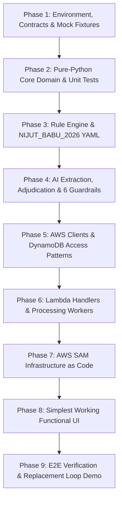

# AGENT IMPLEMENTATION PLAN — Defect Guard

**Author:** Antigravity (AI Implementation Agent)  
**Target Repository:** `/defect-guard`  
**Active Branch:** `backend`  
**Governing Documents:** `PROJECT.md` (what and why), `IMPLEMENTATION.md` (how and when), `First_Commit_Master_Hackathon_Info.md` (rules and boundaries).  
**Memory Synchronization:** `defect-guard/agent_brain.md` (machine-readable state, decisions, gotchas).

---

## 1. Executive Summary & Strategy

This implementation plan defines the complete step-by-step roadmap for building the functional Defect Guard application on the `backend` branch.

### Key Tenets:
1. **Incremental Commits:** Small, significant, coherent Git commits. Every commit must keep the repo in a functional/validated state.
2. **Strict Architectural Separation:** `backend/src/core/` is 100% pure Python with **zero AWS/boto3 imports**, allowing full offline testability with `pytest`.
3. **Robust Fallbacks & Offline Capability:** Given that the AWS account verification for Bedrock is in progress, the system implements deterministic template fallbacks and fixture mocks so that the entire pipeline can execute and be validated end-to-end locally and in tests.
4. **Simplest Functional UI:** A clean, unstyled, completely working functional UI that executes the full student loop: Start Packet → Upload 4 Documents → Extract → View Snapshot → Run Check → View Verdict & Readiness Score → Replace Document → Re-check.

---

## 2. Phase Breakdown & Commit Milestones

---

### Phase 1: Environment, Contracts & Mock Fixtures
**Goal:** Establish Python virtual environment, dependencies, unified Pydantic v2 data models, shared vocabulary, and frontend mock fixtures.

* **Commit 1.1: `build(backend): setup requirements.txt and project structure`**
  - Create `backend/requirements.txt` (`boto3>=1.40`, `pydantic>=2.0`, `pyyaml>=6.0`, `pytest>=8.0`).
  - Set up directory skeleton (`backend/src/core/`, `backend/src/aws/`, `backend/src/ai/`, `backend/src/handlers/`, `backend/tests/`).
  - Validation: Virtual environment creation and `pip install -r requirements.txt` succeeds.

* **Commit 1.2: `feat(core): implement Pydantic v2 data models and shared field constants`**
  - Implement `backend/src/core/models.py` strictly matching `IMPLEMENTATION.md` §5 & §9:
    - `DocumentRole` enum: `AADHAAR`, `INCOME_CERTIFICATE`, `MARKSHEET`, `BANK_PROOF`.
    - `PacketStatus`, `DocumentStatus`, `Severity`, `FindingCategory`, `VerdictBand`, `AIStatus`.
    - `ExtractedField`, `DocumentExtraction`, `SnapshotRow`, `Snapshot`, `Finding`, `Verdict`, `Packet`.
    - API request/response models (`CreatePacketResponse`, `CreateUploadUrlRequest`, `CreateUploadUrlResponse`, `RunCheckResponse`).
  - Implement `backend/src/core/fields.py`:
    - All 21 canonical field keys.
    - Role-to-field mappings and Textract query definitions per role.
  - Validation: Python model imports and schema generation tests pass.

* **Commit 1.3: `test(fixtures): generate verified packet_checked and packet_extracting mock fixtures`**
  - Create `frontend/fixtures/packet_checked.json` and `frontend/fixtures/packet_extracting.json` matching the contracts.
  - Validation: Fixtures parse cleanly into `Packet` Pydantic model without validation errors.

---

### Phase 2: Pure-Python Core Domain & Unit Tests
**Goal:** Implement all deterministic normalization, validation, masking, snapshot generation, and scoring logic offline without AWS dependencies.

* **Commit 2.1: `feat(core): implement normalizers, masking, and verhoeff/ifsc validators`**
  - Implement `backend/src/core/normalize.py`:
    - Name normalization: trim, collapse spaces, strip honorifics (`Shri`, `Smt`, `Mr`, `Ms`, `S/o`, `D/o`), strip punctuation, produce lowercase string + token list.
    - Date normalization: parse `DD/MM/YYYY`, `DD-MM-YYYY`, `D MMM YYYY`, etc. to ISO `YYYY-MM-DD`.
    - Money normalization: strip `₹`, `Rs.`, commas, handle words/Lakhs, output integer rupees.
    - IFSC & Account number normalization.
  - Implement `backend/src/core/validators.py`:
    - Aadhaar Verhoeff checksum algorithm (valid & invalid check).
    - IFSC code format regex (`^[A-Z]{4}0[A-Z0-9]{6}$`).
    - File size (≤ 5MB, warning > 200KB) and MIME type validators.
  - Implement `backend/src/core/masking.py`:
    - `mask_aadhaar`: retain only last 4 digits (`XXXXXXXX1234`) and Verhoeff validity.
    - `mask_account`: retain only last 4 digits (`XXXXXX5678`).
  - Validation: `pytest backend/tests/test_normalize.py backend/tests/test_validators.py` passes with 100% assertions.

* **Commit 2.2: `feat(core): implement snapshot builder with canonical precedence and disagreement detection`**
  - Implement `backend/src/core/snapshot.py`:
    - Takes active document extractions (excluding superseded ones).
    - Assembles `SnapshotRow` for each scheme field.
    - Canonical value selection per precedence (`AADHAAR` > `MARKSHEET` > `INCOME_CERTIFICATE` > `BANK_PROOF`).
    - Multi-document disagreement detection using normalized tokens.
  - Validation: Unit test asserting that discordant student names (`RAHUL DAS` vs `RAHUL DASS`) correctly set `hasDisagreement: True`.

* **Commit 2.3: `feat(core): implement readiness scoring and arithmetic engine`**
  - Implement `backend/src/core/scoring.py`:
    - Formula: `score = max(0, 100 - (25 * num_red) - (10 * num_amber))`.
    - Band classification: `READY` (≥85), `RISKY` (60–84), `NOT_READY` (<60).
    - Detailed `scoreArithmetic` string: e.g., `"100 - 25x2 red - 10x1 amber = 40"`.
  - Validation: `pytest backend/tests/test_scoring.py` covering boundary conditions (59/60, 84/85).

---

### Phase 3: Scheme Rules Engine & NIJUT_BABU_2026 Ruleset
**Goal:** Implement the deterministic MMNBA scheme ruleset in YAML and the execution engine.

* **Commit 3.1: `feat(rules): define NIJUT_BABU_2026.yaml ruleset with official MMNBA 2026 citations`**
  - Implement `backend/src/core/rules/NIJUT_BABU_2026.yaml`:
    - Scheme metadata: `NIJUT_BABU_2026`, ₹4,00,000 income ceiling, 4 mandatory roles.
    - 11 Rules:
      - R-01: Student name mismatch across documents (RED, Identity)
      - R-02: Father's/guardian's name mismatch (RED, Identity)
      - R-03: Account holder name mismatch (RED, Bank)
      - R-04: Institution name mismatch / verification needed (VERIFY/AMBER, Academic)
      - R-05: Missing mandatory supporting document (RED, Completeness)
      - R-06: Gender is not Male (RED, Eligibility)
      - R-07: Declared annual income exceeds ₹4.00 lakh ceiling (RED, Eligibility)
      - R-08: Income certificate authority verification (VERIFY/AMBER, Eligibility)
      - R-09: Unreadable or low quality document (AMBER, Quality)
      - R-10: Uploaded document does not match declared slot (AMBER, Document Format)
      - R-11: Unsupported file type or file exceeds size cap (AMBER, Document Format)
    - Every rule includes `source`, `sourceUrl`, `defaultReason`, and `defaultFix`.

* **Commit 3.2: `feat(rules): implement rule engine with finding generation and deduplication`**
  - Implement `backend/src/core/rules/engine.py`:
    - Pure Python evaluation of Snapshot and document metadata against the YAML ruleset.
    - Stable finding ID generation (`f1`, `f2`, ...).
    - Flagging findings requiring AI adjudication (`needsAdjudication: true` for R-01, R-02, R-04).
    - Merge rules for overlapping identity findings.
  - Validation: `backend/tests/test_rules.py` passing against synthetic demo extractions.

---

### Phase 4: AI Extraction, Adjudication & 6 Guardrails
**Goal:** Implement Bedrock structured output schemas, prompt generators, and the 6 strict deterministic guardrails with fallback handling.

* **Commit 4.1: `feat(ai): define Bedrock structured output schemas and prompt builders`**
  - Implement `backend/src/ai/schemas.py`:
    - JSON Schemas for extraction (`roleConfirmed`, `documentQuality`, `fields`).
    - JSON Schemas for adjudication (`findingId`, `isRealConflict`, `confidence`, `reason`, `fixInstruction`, `rankHint`).
  - Implement `backend/src/ai/extract.py` and `backend/src/ai/adjudicate.py`:
    - Prompt construction incorporating OCR text, Textract query results, and snapshot context.

* **Commit 4.2: `feat(ai): implement 6 deterministic guardrails and template fallback mechanisms`**
  - Implement `backend/src/ai/validation.py` enforcing the 6 guardrails:
    1. Pydantic schema validation with 1 retry.
    2. Finding ID lock (cannot add or invent finding IDs).
    3. Evidence grounding (all quoted values must appear in extracted text substrings).
    4. Severity lock (`isRealConflict=False` can only downgrade RED to AMBER, never delete; non-identity rules cannot be changed).
    5. Confidence cap (`confidence < 0.6` forces AMBER with cautionary prefix).
    6. Score immunity (LLM never calculates the score).
  - Robust fallback: If Bedrock call fails/unverified, populate reasons and fixes from the rule's `defaultReason` and `defaultFix` with `aiStatus = FALLBACK_TEMPLATE`.
  - Validation: `pytest backend/tests/test_ai_validation.py` asserting all 4 adversarial scenarios are safely neutralized.

---

### Phase 5: AWS Clients & DynamoDB Integration
**Goal:** Implement thin wrappers around `boto3` for S3, Textract, Bedrock, and DynamoDB.

* **Commit 5.1: `feat(aws): implement S3, Textract, Bedrock, and DynamoDB single-table client`**
  - Implement `backend/src/aws/s3_client.py`:
    - Presigned `PUT` URL generation with 5-minute TTL.
    - `head_object` for authoritative content length and content type.
  - Implement `backend/src/aws/textract_client.py`:
    - `analyze_document` with `QUERIES` + `FORMS`.
  - Implement `backend/src/aws/bedrock_client.py`:
    - Converse API invocation with `outputConfig.textFormat`.
    - Handles model profile ID `global.anthropic.claude-sonnet-4-5-20250929-v1:0` and exponential backoff.
  - Implement `backend/src/aws/ddb.py`:
    - Single table `DefectGuard` operations (AP1 through AP5: `GetItem`, `Query`, `PutItem`, `UpdateItem`).
    - Automatic `expiresAt` (24h TTL) timestamp computation.

---

### Phase 6: Lambda Handlers & Worker Pipeline
**Goal:** Implement the 5 Lambda functions matching the API contract and async worker flow.

* **Commit 6.1: `feat(handlers): implement API handlers with input validation and DynamoDB operations`**
  - `backend/src/handlers/create_packet.py` (POST /packets -> 201)
  - `backend/src/handlers/create_upload_url.py` (POST /packets/{id}/documents -> 201)
  - `backend/src/handlers/mark_uploaded.py` (POST /packets/{id}/documents/{id}/uploaded -> 202, triggers worker)
  - `backend/src/handlers/run_check_api.py` (POST /packets/{id}/check -> 202, triggers worker)
  - `backend/src/handlers/get_packet.py` (GET /packets/{id} -> 200, returns full packet envelope)

* **Commit 6.2: `feat(handlers): implement asynchronous extraction and check worker handlers`**
  - `backend/src/handlers/extract_document.py`: Worker lambda for Textract + Bedrock extract + masking + DynamoDB update.
  - `backend/src/handlers/run_check.py`: Worker lambda for building snapshot + running rules + AI adjudication + score computation + VERDICT# write.

---

### Phase 7: Infrastructure as Code (AWS SAM)
**Goal:** Package the entire serverless architecture into SAM `template.yaml`.

* **Commit 7.1: `feat(infra): create AWS SAM template for DynamoDB, S3, Lambdas, and HTTP API`**
  - `infra/template.yaml`:
    - DynamoDB `DefectGuard` table with PAY_PER_REQUEST and TTL.
    - S3 Bucket `defect-guard-uploads` with BPA, SSE-S3 AES256, 1-day expiration, and CORS.
    - HTTP API Gateway with `/v1` endpoints.
    - 5 Lambda functions with least-privilege IAM policy (`bedrock:InvokeModel`, `textract:AnalyzeDocument`, DynamoDB CRUD, S3 read/write).
    - SAM configuration `infra/samconfig.toml`.
  - Validation: `sam validate --template-file infra/template.yaml` succeeds.

---

### Phase 8: Simplest Working Functional UI
**Goal:** Build a functional, no-frills UI that connects to the backend endpoints and provides a complete, interactive user workflow.

* **Commit 8.1: `feat(frontend): implement simplest functional UI for upload, snapshot, findings, and re-check`**
  - Implement a clean functional frontend (can be Next.js or direct functional HTML/TS app):
    - Document upload slots for the 4 documents.
    - Status polling indicator (DRAFT -> EXTRACTING -> READY_TO_CHECK -> CHECKING -> CHECKED).
    - Application Snapshot table showing side-by-side values with disagreement highlights.
    - Defect list displaying severity chips (RED/AMBER/VERIFY), reason, and fix instructions.
    - Readiness score card displaying score and arithmetic explanation.
    - Document replacement button & Re-check button to verify the dynamic score update.
  - Validation: Successful upload, check, and verdict display in browser.

---

### Phase 9: End-to-End Verification & Demo Simulation
**Goal:** Validate the complete loop with synthetic MMNBA test cases.

* **Commit 9.1: `test(e2e): create end-to-end verification script and synthetic demo data`**
  - Implement `scripts/e2e.py` testing the complete flow:
    - Packet creation -> 4 document upload simulation -> Check run.
    - Verification of 3 planted defects: Name mismatch (RED), Income threshold breach (RED), Institution mismatch (VERIFY).
    - Readiness score verification (40 / NOT_READY).
    - Replacement of income certificate with compliant certificate -> Re-check -> Finding cleared -> Score updated to 50.
  - Validation: `python scripts/e2e.py` completes green with all assertions satisfied.

---

## 3. Persistent Agent Brain Maintenance

At every commit boundary:
1. `defect-guard/agent_brain.md` will be updated with:
   - Current phase and commit status.
   - Any new architectural decisions made.
   - Any gotchas or platform-specific behaviors discovered.
2. Contradictions will be verified and resolved, not silently ignored.
3. Repositories will remain in a working, passing state after each commit.
